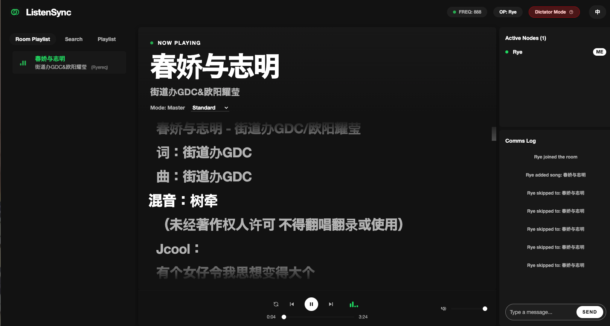
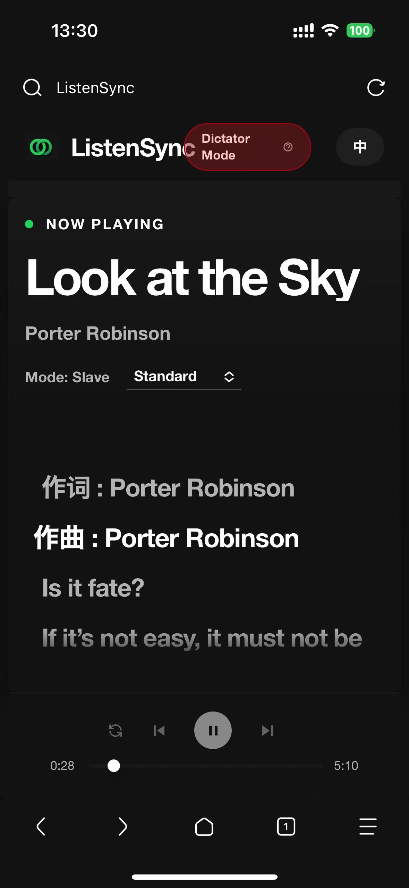

<div align="center">
  
  <h1>Listening</h1>
</div>

<p align="center">
  <a href="https://vuejs.org/"></a>
  <a href="https://vitejs.dev/"></a>
  <a href="https://expressjs.com/"></a>
  <a href="https://socket.io/"></a>
  <a href="https://www.typescriptlang.org/"></a>
</p>

Listening 是一款支持多人实时同步播放音乐的 Web 应用程序。房主可以控制播放进度、切歌和更改播放模式，房间内的其他成员可以实时同步收听，体验如临现场的“一起听”功能。

## 项目效果图 (Screenshots)

<div align="center">
  <h3>桌面端效果 (Desktop)</h3>
  
  
  <h3>移动端效果 (Mobile)</h3>
  
</div>

## 核心特性 (Features)

- **实时音乐同步播放**：基于类似 NTP 的时钟同步机制与 Socket.IO，实现客户端与服务端的精准毫秒级播放同步。
- **响应式设计与多端适配**：分离了桌面端 (`AppDesktop`) 与移动端 (`AppMobile`) 布局逻辑，在移动端提供了更友好的抽屉式菜单和交互体验。
- **模块化架构**：
  - 前端基于 Vue 3 Composition API，抽离出高度复用的 `composables`（如 `useAuth`、`useSocket`、`usePlayer` 等）。
  - 后端基于 Express 路由模块化（分离了搜索、歌词、代理等接口）和 Socket.IO 事件分发（独立处理房间、播放器、聊天、投票等逻辑）。
- **房间权限管理**：
  - **房主特权**：支持控制播放、暂停、进度调节、切歌、更改播放模式（列表循环、单曲循环、随机播放），并可进行权限转移和撤销。
  - **听众模式**：普通成员仅能调节本地音量，无法干扰房主播放状态。
- **国际化支持 (i18n)**：内置中英文（zh/en）双语切换。
- **现代化 UI**：采用 TailwindCSS v4 构建的类 Spotify 风格暗黑主题音乐播放器界面。
- **用户认证与安全**：基于 `better-sqlite3` 和 `bcrypt` 本地存储用户信息，使用 JWT (JSON Web Token) 进行状态保持和 Socket 鉴权。
- **多音源聚合**：内置定制 API 接口，支持聚合解析多个主流平台的音源。

## 技术栈 (Tech Stack)

### 前端 (Frontend)

- **核心框架**: Vue 3 (Composition API) + TypeScript
- **构建工具**: Vite
- **样式**: TailwindCSS v4
- **路由与状态**: Vue Router + Vue I18n + 响应式 Store (`state.ts`)
- **实时通信**: Socket.IO Client

### 后端 (Backend)

- **服务框架**: Express.js + Node.js
- **实时通信**: Socket.IO
- **数据库**: SQLite3 (`better-sqlite3`)
- **状态管理**: 独立的 `RoomStore` 管理房间状态
- **认证加密**: JWT (`jsonwebtoken`) + `bcrypt`
- **开发工具**: `ts-node` + `nodemon`

## 安装与运行 (Installation & Usage)

### 环境要求 (Prerequisites)

- [Node.js](https://nodejs.org/) (推荐 >= 18.x)
- npm

### 1. 克隆项目

```bash
git clone https://github.com/your-username/Listening.git
cd Listening
```

### 2. 安装依赖

项目使用了 npm workspaces 机制，可以在根目录一次性安装所有前后端依赖：

```bash
npm install
```

### 3. 本地开发与运行

根目录的 `package.json` 提供了便捷的启动脚本。运行以下命令将通过 `concurrently` 同时启动前端开发服务器和后端 API 服务：

```bash
npm run dev
```

- 前端服务默认运行在：`http://localhost:5173`
- 后端服务默认运行在：`http://localhost:3000`

### 4. 构建生产版本

同时构建前端和后端代码：

```bash
npm run build
```

运行生产环境后端：

```bash
npm run start
```

*(注意：生产环境通常需要通过 Nginx/Caddy 等代理前端静态文件和后端接口)*

## 项目结构 (Project Structure)

```text
Listening/
├── frontend/                # 前端 Vue3 项目代码
│   ├── src/
│   │   ├── assets/          # 静态资源 (图片、图标等)
│   │   ├── components/      # 拆分后的 Vue 核心组件 (auth, layout, player, sidebar 等)
│   │   ├── composables/     # 组合式函数 (useAuth, useSocket, usePlayer 等)
│   │   ├── store/           # 全局状态管理 (state.ts)
│   │   ├── utils/           # 工具函数 (包括 lx-engine 音源引擎)
│   │   ├── App.vue          # 根组件
│   │   ├── i18n.ts          # 国际化配置
│   │   └── main.ts          # 前端入口文件
│   ├── index.html           # HTML 模板
│   └── vite.config.ts       # Vite 配置文件
│
├── backend/                 # 后端 Express 项目代码
│   ├── src/
│   │   ├── routes/          # Express 路由模块 (search, lyric, musicUrl 等)
│   │   ├── services/        # 核心服务 (RoomStore 等)
│   │   ├── socket/          # Socket.IO 服务端逻辑与事件分发 (handlers)
│   │   ├── types/           # TypeScript 类型定义
│   │   ├── auth.ts          # 认证逻辑
│   │   ├── db.ts            # SQLite 数据库配置与初始化
│   │   ├── playlist.ts      # 播放列表辅助逻辑
│   │   └── index.ts         # 后端应用入口
│   └── LXMUSIC.js           # 自定义音乐 API 逻辑
│
├── package.json             # Root Workspace 配置
└── README.md                # 项目说明文档
```

